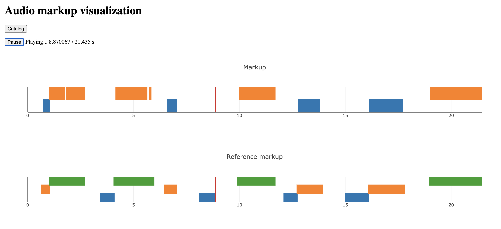

# Audio markup visualization tool

- Client server app that can visualise markup for audio
- Originally designed to be used for audio diarization markup visualization (displays speaker activity intervals within audio - see screenshot below)
- can be adapted for other kinds of markup

## Markup format:
- `.json` file, containing data in following format
```
{
    "speaker1": [{"start": 0, "stop": 1337}, ...],
    ...
}
```
where every timestamp - is integer value, denoting time in **ms**.  
Every speaker will have it's own track, displaying this speaker's activity in audio (see screenshot below).

- `.ass` files with speaker labels and timestamps (text is unnecessary)

## Features:
- supports unlimited number of speakers/tracks
- can display up to two markup files for same audio simultaneously (may be increased later)
- in case when markup is not available, will just play audio
- simple audio catalog, displaying info about file sizes, markup availability


## How to launch:
- requires python3.6, pip
- checkout configuration in src/config.json
```
pip install -r src/requirements.txt
cd src
python server.py
```
- then visit `host:port` (from config file - localhost:8000 by default) in your browser

## Screenshot:




## Dependencies:
- Python3.6, pip
- [Sanic 20.6.3](https://sanic.readthedocs.io/en/latest)
- [Librosa 0.8.0](https://librosa.org/doc/latest/index.html)
- [JQuery v1.12.4](https://jquery.com)
- [Plotly.js 1.52.3](https://plotly.com/javascript/)

Frontend dependencies (JQuery and Plotly.js) already included


## Limitations / TODO:
- for now supports uploading up to two markup files along with audio
- [browser supported audio formats](https://developer.mozilla.org/ru/docs/Web/HTML/%D0%9F%D0%BE%D0%B4%D0%B4%D0%B5%D1%80%D0%B6%D0%B8%D0%B2%D0%B0%D0%B5%D0%BC%D1%8B%D0%B5_%D0%BC%D0%B5%D0%B4%D0%B8%D0%B0_%D1%84%D0%BE%D1%80%D0%BC%D0%B0%D1%82%D1%8B)
- `.json` and `.ass` markup (described previously) - to provide support for other formats, `server.py` modification is necessary
- for not doesn't support playback from arbitrary position
- doesn't display labels for speakers/tracks
- audio playback and, in consequence, visualization doesn't work in safari
- can not display markup without audio file, but can play audio without markup


## License

The source code for the site is licensed under the MIT license, which you can find in
the LICENSE.md file.

All graphical assets are licensed under the
[Creative Commons Attribution 3.0 Unported License](https://creativecommons.org/licenses/by/3.0/).
